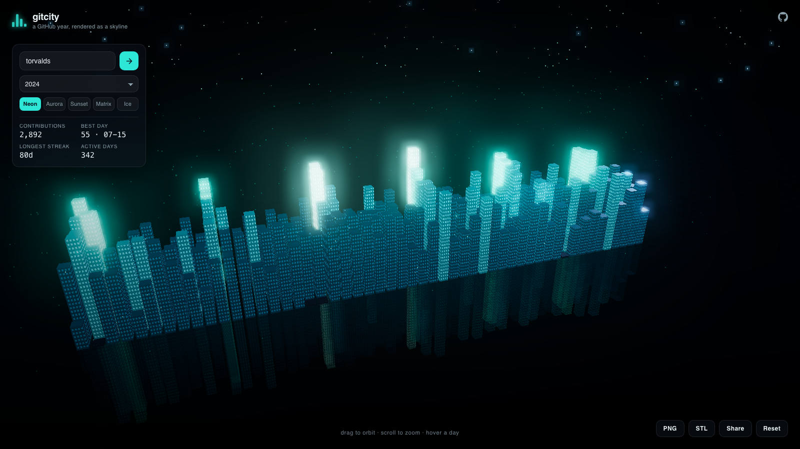
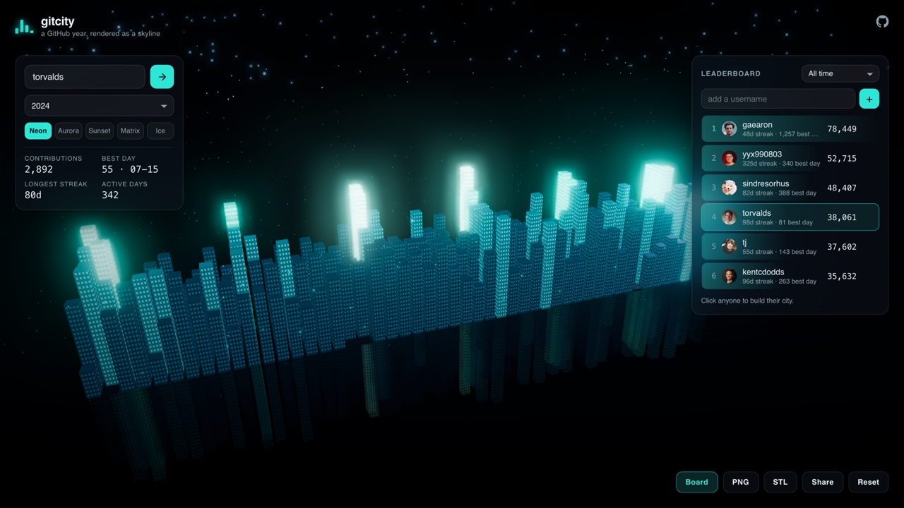
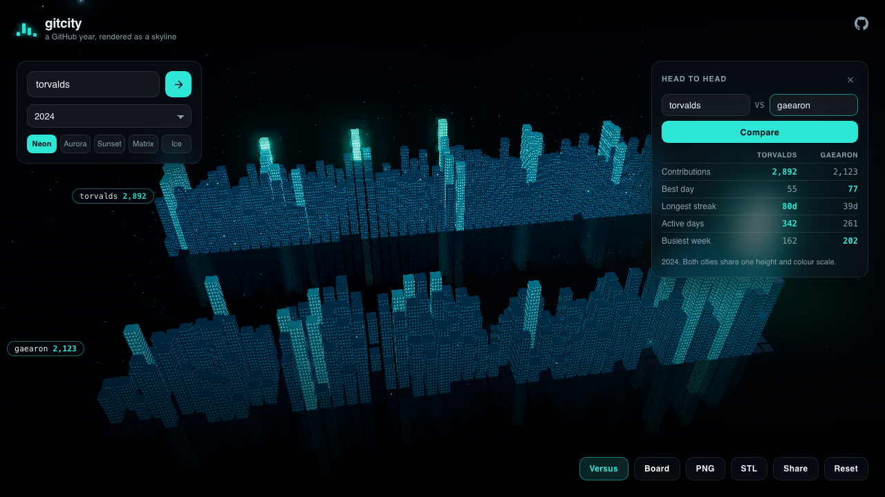
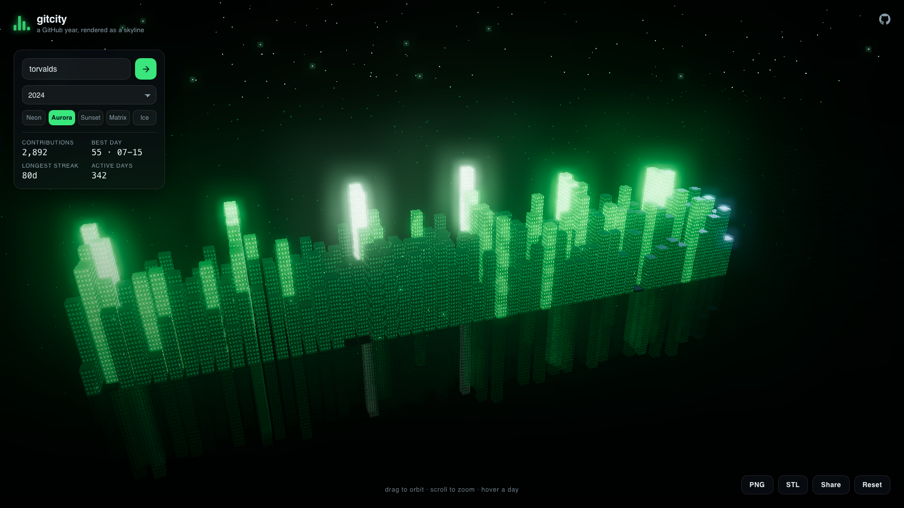
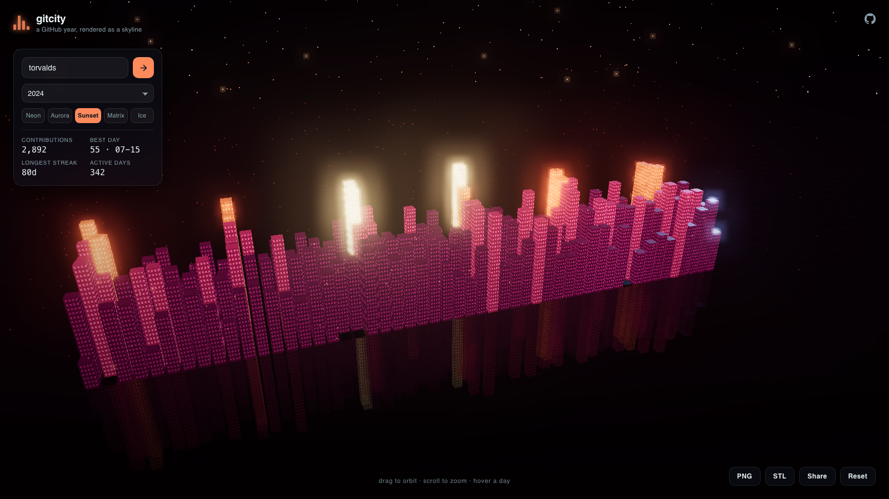
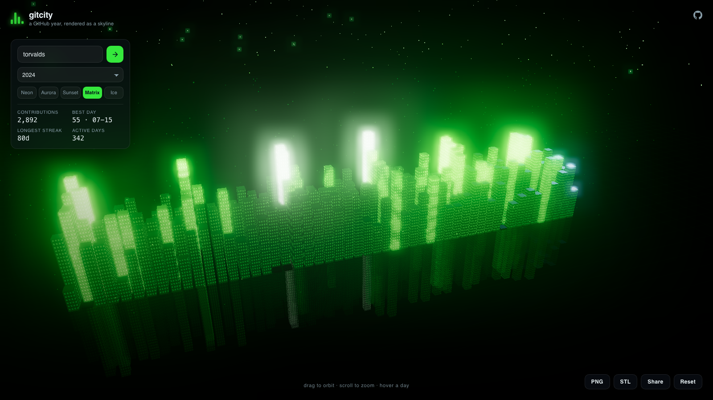
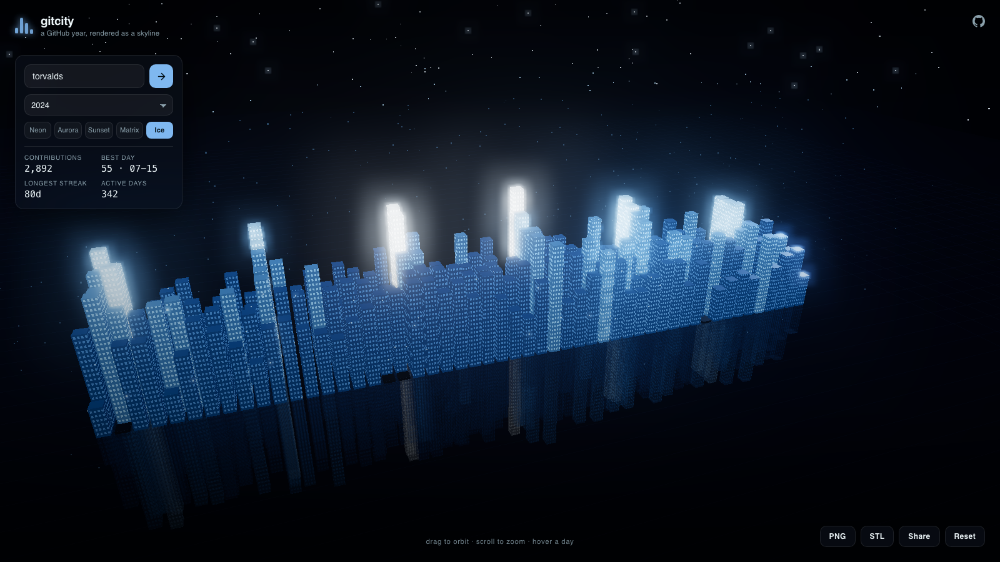

# gitcity

Turn any GitHub contribution graph into a living 3D city. Every day is a building, height is commit volume, and the whole year lights up as a skyline you can orbit.

**[Open the live demo](https://aprilnh7.github.io/gitcity/?user=torvalds&range=2024)**



## Why

GitHub's own Skyline was the fun way to look back at a year of work, and it is gone. `skyline.github.com` no longer resolves. gitcity is a replacement that runs entirely in the browser, needs no login, and does more than the original: five themes, per-day inspection, PNG export, and the STL export that made Skyline worth printing.

## What it does

- **Any profile, any year.** Type a username, pick a year or the rolling last twelve months.
- **Reads exactly like your graph.** Colour follows GitHub's own 0 to 4 intensity levels, so the city and the contribution graph always agree.
- **Log scaled heights.** One 100 commit day does not flatten the rest of the year into the pavement.
- **Hover any building** to see the date and exact count.
- **Leaderboard.** Rank up to twelve people by contribution volume across all time, the rolling last twelve months, or any single year. Click a row to build that person's city.
- **Head-to-head.** Drop two people into one scene on one shared scale and read the gap off the skyline.
- **Five themes.** Neon, Aurora, Sunset, Matrix, Ice.
- **Save a PNG** of the current camera angle.
- **Export an STL** and print your year. Buildings sit on a base plate, ready to slice.
- **Shareable links.** `?user=torvalds&range=2024&theme=sunset` restores the exact view, `?users=a,b,c&period=all` restores a board, and `?vs=a,b` restores a head-to-head.

## Leaderboard

Put a group side by side and rank them by contribution volume, across all time, the rolling last twelve months, or any single year. Click a row to build that person's city.



**[Open this board](https://aprilnh7.github.io/gitcity/?user=torvalds&range=2024&users=torvalds,sindresorhus,gaearon,yyx990803,kentcdodds,tj&period=all)**

Your board is remembered locally and travels in the URL, so a link carries the whole comparison.

## Head to head

Two people, one scene, one scale. Both years are rendered as neighbouring districts and a table breaks the year down into five numbers with the winner of each highlighted.



**[Open this comparison](https://aprilnh7.github.io/gitcity/?vs=torvalds,gaearon&range=2024)**

The shared scale is the whole point. Heights and colours are bucketed against the busiest day found across *both* accounts, not each account's own maximum, so a quiet year genuinely looks quiet next to a loud one. Read against GitHub's per profile intensity levels the two skylines would look identical no matter how far apart the totals were.

On a phone the pair is turned a quarter so the year runs down the long axis and the two cities sit left and right instead of one behind the other.

## Themes

| Aurora | Sunset |
| --- | --- |
|  |  |

| Matrix | Ice |
| --- | --- |
|  |  |

## How it works

The whole city is a single `InstancedMesh`, one instance per day, so a full year is one draw call.

`MeshStandardMaterial` has no per-instance emissive slot, which is a problem when every building needs to glow its own colour. gitcity patches the shader in `onBeforeCompile` and drives `totalEmissiveRadiance` from the instance colour instead. The same patch adds the window grid, generated procedurally from world position and surface normal, so rows line up across a building regardless of how tall it scaled and every wall gets covered without a texture.

The reflection is a second `InstancedMesh` sharing the same matrices with `scale.y = -1`, sitting under a semi-transparent plaza. Cheaper than a real reflection pass and it survives bloom, which a `Reflector` does not.

Camera framing projects all eight corners of the city's bounding box into camera space and solves for the distance that keeps every corner inside the frustum. That is what keeps the full year in frame on both an ultrawide monitor and a portrait phone.

The leaderboard costs exactly one request per person no matter how many periods you compare. The all time payload carries a per year total map alongside the day array, so switching between all time, the last twelve months, and individual years is a local re-sort with no network traffic.

## Data

Contribution data comes from [github-contributions-api](https://github-contributions-api.jogruber.de), a public, read-only mirror of the profile graph. No token, no login, nothing stored. If the API is unreachable the app falls back to a generated demo city so the scene is never empty.

## Run it locally

```bash
npm install
npm run dev
```

Then open http://localhost:5173.

```bash
npm run build             # type check + production bundle
npm run smoke             # end-to-end checks against a running dev server
npm run smoke:resilience  # failure paths, with the API stubbed out
```

The smoke test covers data loading, hover raycasting, theme switching, STL and PNG export, the leaderboard, head-to-head comparison, unknown user handling, deep links, and the mobile layout.

The resilience test covers what happens when things go wrong: a request that fails once and succeeds on retry, an API that never answers, a username that does not exist, and Compare being clicked while another city is still building.

## Contributing

Issues and pull requests are welcome. Good first additions: new themes in `src/themes.ts` (self contained, just a colour ramp and a couple of numbers), a glTF exporter alongside the STL one, or an orthographic camera mode.

## License

MIT
